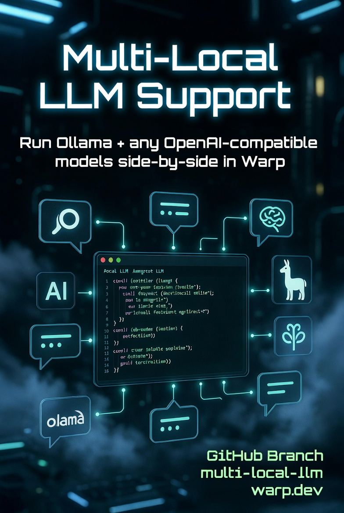

<a href="https://www.warp.dev">
    
</a>
&nbsp;
<p align="center">
  <a href="https://www.warp.dev"></a>
  &nbsp;
  <a href="https://oz.warp.dev"></a>
</p>

<p align="center">
  <a href="https://www.warp.dev">Website</a>
  ·
  <a href="https://www.warp.dev/code">Code</a>
  ·
  <a href="https://www.warp.dev/agents">Agents</a>
  ·
  <a href="https://www.warp.dev/terminal">Terminal</a>
  ·
  <a href="https://www.warp.dev/drive">Drive</a>
  ·
  <a href="https://docs.warp.dev">Docs</a>
  ·
  <a href="https://www.warp.dev/blog/how-warp-works">How Warp Works</a>
</p>

> [!NOTE]
> OpenAI is the founding sponsor of the new, open-source Warp repository, and the new agentic management workflows are powered by GPT models.

<h1></h1>

# Local-Warp

Local-Warp is a fork of Warp/OpenWarp focused on provider autonomy for agentic development. It keeps Warp's terminal-native coding workflow, then adds **Bring Your Own Key (BYOK)** and **Bring Your Own Provider (BYOP)** so you can choose where inference runs and which credentials are used.

Use Local-Warp with the built-in agent surfaces, external CLI agents such as Claude Code, Codex, Gemini CLI, and OpenCode, or your own OpenAI-compatible, Anthropic, Gemini, DeepSeek, and Ollama endpoints.

## BYOK and BYOP

<a href="https://www.naresh.se">
    
</a>
&nbsp;

Local-Warp's Agent Mode supports **custom AI providers** alongside upstream Warp cloud models. Configure multiple providers simultaneously and pick a specific provider and model per conversation — all from **Settings > AI > Custom AI Providers**.

- **BYOK: Bring Your Own Key** — use your own provider API keys instead of a shared managed credential. Keys are stored locally in the OS keychain and are resolved at dispatch time.
- **BYOP: Bring Your Own Provider** — point Local-Warp at your own provider endpoint, including localhost models, self-hosted OpenAI-compatible servers, vendor APIs, and remote inference gateways.
- **Provider-level routing** — model IDs use the `byop:<provider_id>:<model_id>` format so each conversation can target a precise provider/model pair without changing cloud-model behavior.
- **Local and external-agent orchestration** — opted-in BYOP models can be exposed to Local Native orchestration and supported local child harnesses, with Remote BYOP forwarding prepared through managed-secret metadata.

### Supported Providers

| Provider | API Type | Streaming | Notes |
|---|---|---|---|
| **OpenAI** | OpenAI-compatible | SSE | GPT-4o, GPT-4 Turbo, o-series, and any OpenAI-compatible endpoint |
| **Anthropic** | Native Messages API | SSE | Claude Opus, Sonnet, Haiku via `api.anthropic.com` or self-hosted relays |
| **Ollama** | Native `/api/chat` | NDJSON | Local models (Llama, Mistral, Qwen, etc.) with native tool-call support |
| **Google Gemini** | Native `generateContent` | SSE | Gemini 1.5/2.0 via `generativelanguage.googleapis.com` |
| **DeepSeek** | OpenAI-compatible | SSE | DeepSeek-Chat and DeepSeek-Reasoner (chain-of-thought rendered separately) |

Any OpenAI-compatible endpoint (LM Studio, vLLM, text-generation-inference, LocalAI, etc.) works out of the box with the **OpenAI** API type.

### Key Features

- **Local-Warp branding** — package metadata, desktop entries, and the About page identify the app as Local-Warp while preserving stable channel IDs where they are needed for app data and update compatibility.
- **Multiple providers at once** — run Ollama locally, Anthropic in the cloud, and a remote OpenAI-compatible box side by side. Each conversation picks its own provider and model.
- **Private key handling** — provider API keys live in the OS keychain; docs, logs, telemetry, and crash reports should never include raw keys or bearer tokens.
- **One-click model discovery** — the **Fetch models** button queries each provider's upstream model-list endpoint; the **Browse catalog** modal pre-fills metadata from the open-source [models.dev](https://models.dev) catalog.
- **Multimodal attachments** — attach images, PDFs, and audio files to agent turns via the file-picker button, drag-and-drop, or paste-from-clipboard. Each adapter translates attachments into the provider's native wire format. Per-model capability chips (image / pdf / audio) in settings control which modalities are allowed.
- **Dedicated compaction model** — route conversation summarization to a separate, cheaper model (e.g., Haiku or a local Ollama model) while the primary agent model handles reasoning and tool use. Configure via the **Summarization model** dropdown in the BYOP settings section.
- **Test connection** — per-provider probe button confirms endpoint reachability before you start a conversation.
- **Auto-migration** — existing single-provider configurations are migrated automatically on first launch.

### Configuration

Providers are stored in `settings.toml` under `agents.warp_agent.providers`. API keys are stored in the OS keychain via `AgentProviderSecrets`. See [`specs/multi-local-llm/design.md`](specs/multi-local-llm/design.md) for the full architecture and [`specs/multi-local-llm/README.md`](specs/multi-local-llm/README.md) for per-phase implementation status.

## Installation

Local-Warp can be built from this branch with the standard repository scripts:

```bash
./script/bootstrap
./script/run
```

Packaged local/OSS builds use the visible **Local-Warp** name. Upstream Warp installation docs remain useful for platform prerequisites, but Local-Warp-specific BYOK/BYOP behavior is documented in [`specs/multi-local-llm/`](specs/multi-local-llm/).

## Warp Contributions Overview Dashboard

Explore [build.warp.dev](https://build.warp.dev) to:
- Watch thousands of Oz agents triage issues, write specs, implement changes, and review PRs
- View top contributors and in-flight features
- Track your own issues with GitHub sign-in
- Click into active agent sessions in a web-compiled Warp terminal

## Oz for OSS

Maintaining a popular open-source project? [Apply for Oz credits](https://tally.so/r/LZWxqG) to explore [Oz for OSS](https://github.com/warpdotdev/oz-for-oss).

Oz for OSS is our partner program for bringing the same agentic open-source management workflows used in this repository to select partner repositories. We work directly with maintainers to implement workflows for issue triage, PR review, community management, and contributor coordination in a way that fits each project.

## Licensing

Local-Warp inherits Warp's licensing model. Warp's UI framework (the `warpui_core` and `warpui` crates) are licensed under the [MIT license](LICENSE-MIT).

The rest of the code in this repository is licensed under the [AGPL v3](LICENSE-AGPL).

## Open Source & Contributing

Local-Warp's client codebase is open source and lives in this repository. We welcome community contributions, especially improvements to BYOK/BYOP provider support, native adapters, local orchestration, packaging, and security hardening around provider secrets. For the full contribution flow, read our [CONTRIBUTING.md](CONTRIBUTING.md) guide.

> [!TIP]
> **Chat with contributors and the Warp team** in the [`#oss-contributors`](https://warpcommunity.slack.com/archives/C0B0LM8N4DB) Slack channel — a good place for ad-hoc questions, design discussion, and pairing with maintainers. New here? [Join the Warp Slack community](https://go.warp.dev/join-preview) first, then jump into `#oss-contributors`.

### Issue to PR

Before filing, [search existing issues](https://github.com/warpdotdev/warp/issues?q=is%3Aissue+is%3Aopen+sort%3Areactions-%2B1-desc) for your bug or feature request. If nothing exists, [file an issue](https://github.com/warpdotdev/warp/issues/new/choose) using our templates. Security vulnerabilities should be reported privately as described in [CONTRIBUTING.md](CONTRIBUTING.md#reporting-security-issues).

Once filed, a Warp maintainer reviews the issue and may apply a readiness label: [`ready-to-spec`](https://github.com/warpdotdev/warp/issues?q=is%3Aissue+is%3Aopen+label%3Aready-to-spec) signals the design is open for contributors to spec out, and [`ready-to-implement`](https://github.com/warpdotdev/warp/issues?q=is%3Aissue+is%3Aopen+label%3Aready-to-implement) signals the design is settled and code PRs are welcome. Anyone can pick up a labeled issue — mention **@oss-maintainers** on an issue if you'd like it considered for a readiness label.

### Building the Repo Locally

To build and run Local-Warp from source:

```bash
./script/bootstrap   # platform-specific setup
./script/run         # build and run Local-Warp
./script/presubmit   # fmt, clippy, and tests
```

See [AGENTS.md](AGENTS.md) for the full engineering guide, including coding style, testing, and platform-specific notes.

## Joining the Team

Interested in joining the team? See our [open roles](https://www.warp.dev/careers).

## Support and Questions

1. See our [docs](https://docs.warp.dev/) for a comprehensive guide to Warp's features.
2. Read [`specs/multi-local-llm/`](specs/multi-local-llm/) for Local-Warp BYOK/BYOP implementation notes and current smoke-test gates.
3. Join the [Warp Slack Community](https://go.warp.dev/join-preview) to connect with other users and contributors — contributors hang out in [`#oss-contributors`](https://warpcommunity.slack.com/archives/C0B0LM8N4DB).
4. Mention **@oss-maintainers** on any issue to escalate to the team — for example, if you encounter problems with the automated agents.

## Code of Conduct

We ask everyone to be respectful and empathetic. Local-Warp follows the [Code of Conduct](CODE_OF_CONDUCT.md). To report violations, email warp-coc at warp.dev.

## Open Source Dependencies

We'd like to call out a few of the [open source dependencies](https://docs.warp.dev/help/licenses) that have helped Warp to get off the ground:

- [Tokio](https://github.com/tokio-rs/tokio)
- [NuShell](https://github.com/nushell/nushell)
- [Fig Completion Specs](https://github.com/withfig/autocomplete)
- [Warp Server Framework](https://github.com/seanmonstar/warp)
- [Alacritty](https://github.com/alacritty/alacritty)
- [Hyper HTTP library](https://github.com/hyperium/hyper)
- [FontKit](https://github.com/servo/font-kit)
- [Core-foundation](https://github.com/servo/core-foundation-rs)
- [Smol](https://github.com/smol-rs/smol)
